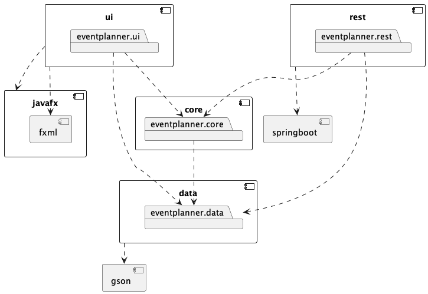
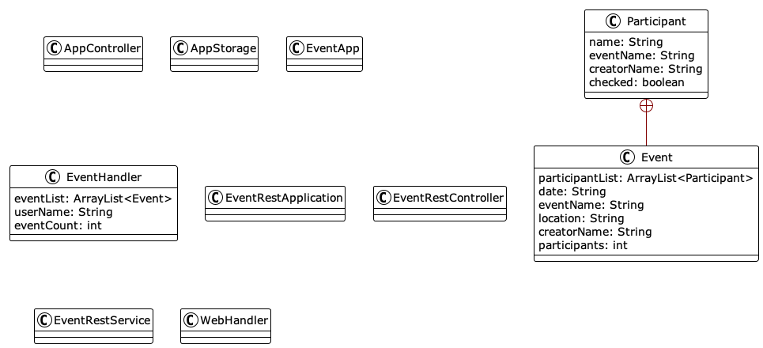

# Setup

The project is divided into 4 modules. Details regarding the modules can be found within their directories.

## Plugins and dependencies

Plugins and dependencies are located withing the pom.xml file. This file also contains configuration and version control for the plugins and dependencies. Some plugins/depedencies are module spesific, and can only be found within their own pom.xml files.

## Project architecture

## Class diagram

## Sequence diagram

## Known bugs

- When updating event info participants of that event, if any, will be removed.
